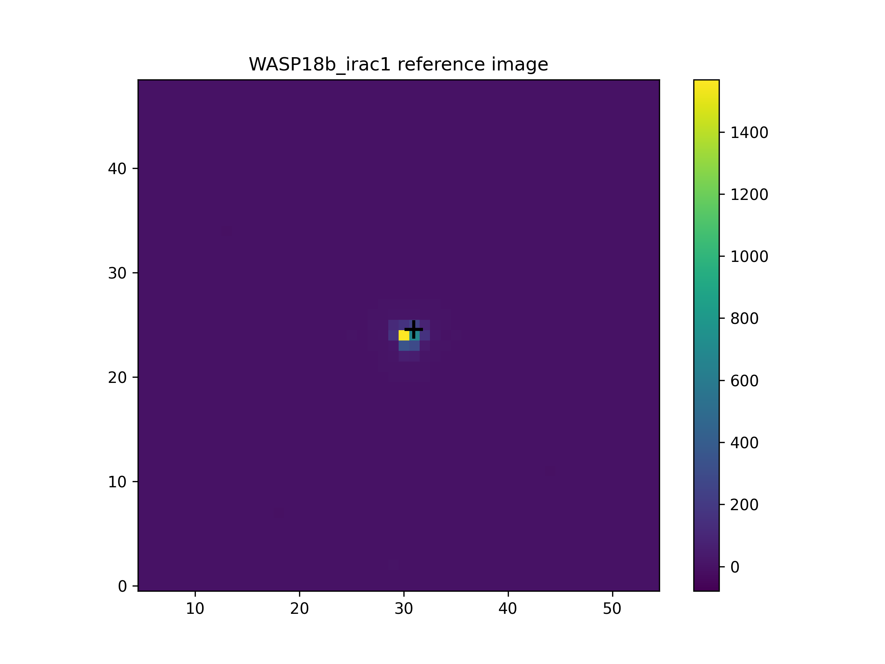
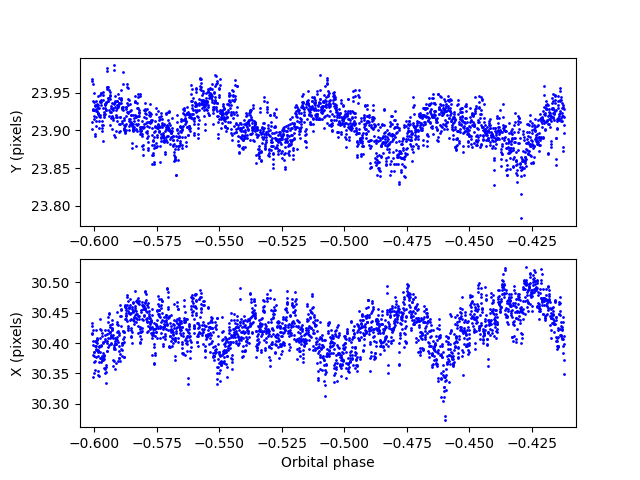
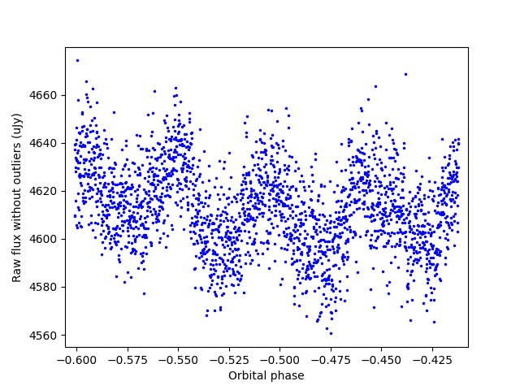
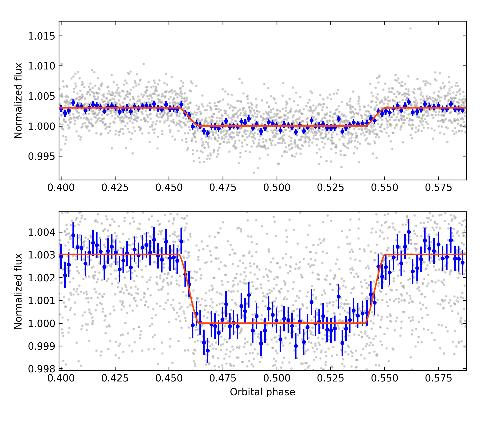
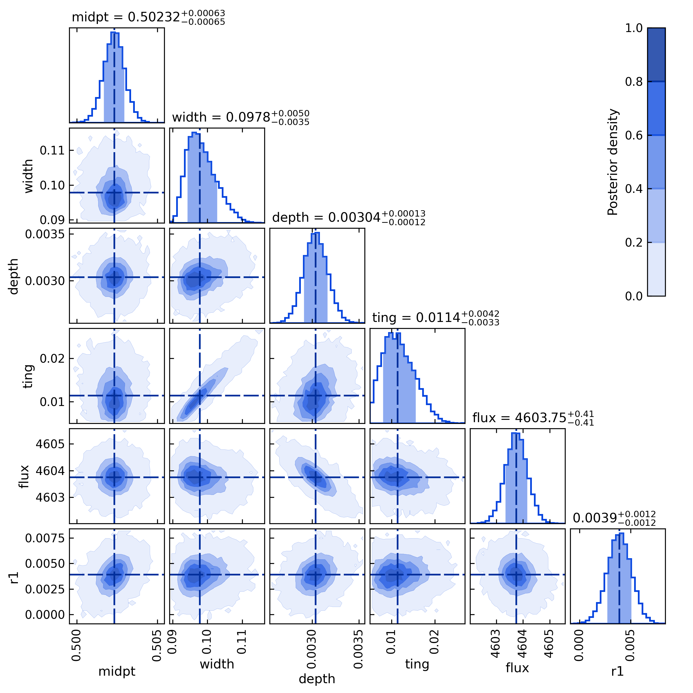

.. _tutorial_wasp18b_eclipse:

WASP-18b Spitzer Eclipse
========================

The following worked example shows the steps to reduce raw Spitzer time-series data of a secondary eclipse of WASP-18b.  There are two main sections in the analysis: first we extract raw 1D light curves from the 3D data cubes (x,y,time).
Second we fit instrumental and astrophysical models to the
raw lightcurves to determine the transit/eclipse/phase-curve properties.

------------------------------------------------------------------------

Download Spizer Data
--------------------

Follow these steps on the browser to download a Spitzer/IRAC1 (3.6 um)
time-series during a secondary-eclipse of WASP-18b:

.. code-block:: shell

  # - Go to the Spitzer Heritage Archive:
  #   https://sha.ipac.caltech.edu/applications/Spitzer/SHA/

  # Normally you would search by target name and then select the AORs
  # of the visit you are interested, but here lets go directly to out dataset:
  # - On the left menu, click on 'AORKEY'
  # - Enter '28775168' in the search bar and click on the 'search' button
  # - Select the one entry, and click on the 'Prepare Download' button
  # - Select Level 1 products, Calibration data, and Including ancilliary.
  # - Click on the 'Prepare Download' button to request the data

  # - When ready, download the data and unzip the file to your
  #   prefered location on your machine

------------------------------------------------------------------------

Raw Light-curve Reduction
-------------------------

The first section of the reduction is subdivided in a sequence of four steps:
(1) reading in the data, (2) bad pixel masking, (3) centering,
and (4) photometry extraction.
Each step is executed separately from a Python session, and each with a
specific configuration file specifying what ``puppies`` should do.

For this example, we have already prepared the configuration files to
reduce the WASP-18b data in this folder from the `Github repository <https://github.com/pcubillos/puppies/tree/master/puppies/data/tutorial_spitzer>`_.
Choose a directory where you will work and fetch the config files into there (e.g., with this shell script below).

.. code-block:: shell

    w18_path=https://raw.githubusercontent.com/pcubillos/puppies/master/puppies/data/tutorial_spitzer
    wget $w18_path/*.cfg
    wget $w18_path/fit_values_WASP18b_irac1.txt

Init / load data
................

This step loads the Spitzer data cubes.  Look into the configuration file
(`pup_WASP18b_irac1.cfg <https://github.com/pcubillos/puppies/blob/master/puppies/data/tutorial_spitzer/pup_WASP18b_irac1.cfg>`_)
and edit the variables to set the data location (`data`) and the working directory (`root`).
The following Python script executes this step:

.. code-block:: python

    import puppies as p

    # Load raw 2D frames (3D counting [X,Y] as function of time):
    cfile = 'pup_WASP18b_irac1.cfg'
    pup = p.init(cfile)

This will create a folder (given by the `ID` variable) and place the output
files there (a log, the data, and figure showing a sample of a frame).

Bad pixel masking
.................

This step identifies and flags bad pixels. For this step we don't need a
configuration file.
The following Python script executes this step:

.. code-block:: python

    import puppies as p
    import puppies.io as io

    # Detect and mask bad pixels:
    pup = io.load("WASP18b_irac1/WASP18b_irac1.p")
    p.core.badpix(pup)

This will create a folder called `badpix` inside the folder from the
previous step, and place the output files there (a log and the data files).

Centering
.........

This step finds the (X,Y) location of the target in the 2D frames.
There are multiple centering methods (Gaussian fitting, center of light,
and least-asymmetry), and some other parameters that can be adjusted with
a configuration file
(`pup_WASP18b_centering.cfg <https://github.com/pcubillos/puppies/blob/master/puppies/data/tutorial_spitzer/pup_WASP18b_centering.cfg>`_).
The following Python script executes this step:

.. code-block:: python

    import puppies as p
    import puppies.io as io

    # Run centering:
    pup = io.load("WASP18b_irac1/badpix/WASP18b_irac1.p")
    cfile = "pup_WASP18b_center.cfg"
    p.core.center(pup, cfile)

This will create one folder for each centering method inside the folder from
the previous step, and place the output files there (a log, data files, and
figures of the X,Y values for each frame).

Photometry
..........

This step performs the photometric extraction from the frames to make
the 1D raw light curves.  The code uses interpolated circular aperture
photometry. Multiple aperture radii, sky inner/outer annuli, and other
parameters can be adjusted with a configuration file
(`pup_WASP18b_photometry.cfg <https://github.com/pcubillos/puppies/blob/master/puppies/data/tutorial_spitzer/pup_WASP18b_photometry.cfg>`_).
The following Python script executes this step:

.. code-block:: python

    import puppies as p
    import puppies.io as io

    # Run aperture photometry (for multiple aperture radii):
    pup = io.load("WASP18b_irac1/badpix/gauss/WASP18b_irac1.p")
    cfile = "pup_WASP18b_photometry.cfg"
    p.core.photom(pup, cfile)

This will create one folder for each aperture inside the folder from
the previous step, and place the output files there (a log, data files, and
figures of the target ans sky photometries).

------------------------------------------------------------------------

Light-curve Fitting
-------------------

The second section of the analysis, the light-curve modeling, can be run
in a more flexible set of steps, but genereally one wants to
(1) determine the best raw light-curve (centering and aperture stettings),
(2) determine the best systematics model(s) (time and  temporal systematics),
(3) run a full final retrieval on the chosen best dataset to get best
parameters and their uncertainties.  And if one is analysing multiple events
for a same target, optionally (4) run a simultaneous joint fit (having shared
parameters for physical properties linking the events).

This time there is a single Python routine that can acomplish all of these
goals.  One can choose to accomplish each goal in a separate run, or can
do them simultaneously, it all depends on the configuration file setting.
In this example, we will split it in two steps.

Dataset and model selection
...........................

To find the best raw light curve, we will use this configuration file: `pup_WASP18b_light_curve_compare.cfg <https://github.com/pcubillos/puppies/blob/master/puppies/data/tutorial_spitzer/pup_WASP18b_light_curve_compare.cfg>`_.
This file defines which modes to fit and on which datasets apply them.
We will execute the run from the same root folder as for the first section.

To find the optimal dataset, the config file will apply the same set of
models on all raw light curves from the previous section (all apertures)
and minimize the residuals between fit and data.

To find the optimal model (i.e., which astrophysical model? which ramp if any?,
BLISS mapping yes or no?) this config file will run three different
set of models (we already know more or less what to expect).
The following Python script executes this comparison:

.. code-block:: python

    from puppies.core import Laika

    # Light-curve modeling (compare datasets and models):
    laika = Laika("pup_WASP18b_light_curve_compare.cfg")
    laika.bestfit()

    # The command below gets the depths (and other values) with errorbars:
    # laika.retrieval()
    # plt.close('all')

This will print out to screen the statistics summary (see below) comparing
the standard deviation of the residuals (SDR, to compare datasets) and BIC
values (to compare models).  Here the lowest SDR points to the aperure of 4.25,
the lowest BIC points to the `mandelecl + linramp + bliss` model configuration.
This info will also be saved to a results.txt file.

.. code-block:: none
    :emphasize-lines: 17, 18, 19

    ...

    WASP18b_irac1        Spitzer/irac1   badpix/gauss/aper3750714
         SDR     dBIC          (percent)  Fit
     11.4433     0.00   depth: 0.3010  mandelecl+linramp+bliss
     11.4642     0.13   depth: 0.2913  mandelecl+bliss
     11.4481     9.49  idepth: 0.2941  eclipse+bliss
                       edepth: 0.2941

    WASP18b_irac1        Spitzer/irac1   badpix/gauss/aper4000714
         SDR     dBIC          (percent)  Fit
     11.4213     0.00   depth: 0.3018  mandelecl+linramp+bliss
     11.4454     1.29   depth: 0.2910  mandelecl+bliss
     11.4261     9.47  idepth: 0.2948  eclipse+bliss
                       edepth: 0.2948

    WASP18b_irac1        Spitzer/irac1   badpix/gauss/aper4250714
         SDR     dBIC          (percent)  Fit
     11.4000     0.00   depth: 0.3017  mandelecl+linramp+bliss
     11.4279     2.72   depth: 0.2901  mandelecl+bliss
     11.4055     9.71  idepth: 0.2995  eclipse+bliss
                       edepth: 0.2995

    WASP18b_irac1        Spitzer/irac1   badpix/gauss/aper4500714
         SDR     dBIC          (percent)  Fit
     11.4704     0.00   depth: 0.2998  mandelecl+linramp+bliss
     11.5015     3.90   depth: 0.2898  mandelecl+bliss
     11.4748     9.30  idepth: 0.2983  eclipse+bliss
                       edepth: 0.2983

    WASP18b_irac1        Spitzer/irac1   badpix/gauss/aper4750714
         SDR     dBIC          (percent)  Fit
     11.4690     0.00   depth: 0.3009  mandelecl+linramp+bliss
     11.5055     5.90   depth: 0.2902  mandelecl+bliss
     11.4750     9.90  idepth: 0.3001  eclipse+bliss
                       edepth: 0.3001

    ... 

Final Retrieval
...............

Once one has chosen a raw dataset and model configuration, we can run
a full retrieval.  This configuration file sets that up for the one we have chosen before:
`pup_WASP18b_light_curve_final.cfg <https://github.com/pcubillos/puppies/blob/master/puppies/data/tutorial_spitzer/pup_WASP18b_light_curve_final.cfg>`_.

.. code-block:: python

    from puppies.core import Laika

    # Light-curve modeling (Full parameters' posterior retrieval):
    laika = Laika("pup_WASP18b_light_curve_final.cfg")
    laika.retrieval()

This will create a folder (with name given by `output` variable in the config
file) and place the output files there (a log, data files, and figures of
the posteriors).
 

