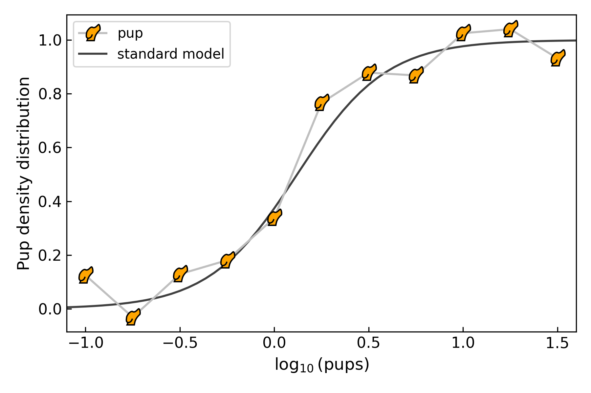

.. _getstarted:

Getting Started
===============

``puppies`` is a general Python library to analyze exoplanet time-series observations (you could say, a general TSO type of tool).

System Requirements
-------------------

``puppies`` is compatible with Python3.6+ and has been `tested <https://travis-ci.com/pcubillos/puppies>`_ to work in both Linux and OS X, with the following software:

* numpy >= 1.8.1
* scipy >= 0.13.3
* matplotlib >= 1.3.1
* astropy >= 3.1
* mc3 >= 3.0.6

.. * sphinx (version 1.7.9+)
   * sphinx_rtd_theme (version 0.4.2+)
   * packaging (version 17.1+)

.. _install:

Install
-------

To install ``puppies`` run the following command from the terminal:

.. code-block:: shell

    pip install exo_puppies

Or if you prefer conda:

.. code-block:: shell

    conda install -c conda-forge puppies

Alternatively (e.g., for developers), clone the repository to your local machine with the following terminal commands:

.. code-block:: shell

  git clone https://github.com/pcubillos/puppies
  cd puppies
  python setup.py develop

------------------------------------------------------------

Once installed, take a look at the ``puppies`` main menu by executing the following command:

.. code-block:: shell

  # Display puppies main help menu:
  pup -h

From there, take a look at the sub-command helps or the rest of these docs for further details, or see the :ref:`qexample` for an introductory worked example.

.. _qexample:

Quick Examples
--------------

Dog of the Day
~~~~~~~~~~~~~~

.. code-block:: shell

  # Show the dog of the day on the browser:
  pup --day

pup matplotlib marker
~~~~~~~~~~~~~~~~~~~~~

.. code-block:: python

  # Plot with pup markers:
  import puppies as p
  import scipy.constants as sc
  import scipy.integrate as si
  import matplotlib.pyplot as plt
  import numpy as np
  plt.ion()

  # Some random curve:
  T = 273.0
  mu = 0.1214 * sc.electron_volt
  pups = np.linspace(-1.0, 1.5, 11)
  np.random.seed(10239)
  z0 = 1.0 / (1.0 + np.exp((mu-pups*sc.electron_volt)/(10*sc.k*T)))
  z = np.random.normal(z0, 0.1, len(pups))

  # Expected model:
  t = np.linspace(-2, 2.5, 100)
  def comp_fermi_dirac_int(t,x):
      return 1.0/(np.exp(t-x)+1)
  model = np.array([
      np.exp(-si.quad(comp_fermi_dirac_int, 0.0, np.inf, args=(x,))[0])
      for x in (mu-t*sc.electron_volt)/(10*sc.k*T)
      ])

  plt.figure(0, (6, 4))
  plt.clf()
  plt.plot(pups, z, marker='pup', mec='k', mfc='orange', c='0.75', label='pup')
  plt.plot(t, model, c='0.25', zorder=-1, label='standard model')
  plt.xlabel(r'$\log_{10}({\rm pups})$', fontsize=12)
  plt.ylabel('Pup density distribution', fontsize=12)
  plt.xlim(-1.1, 1.6)
  plt.legend(loc='upper left')
  plt.tight_layout()
  plt.savefig('pup_markers.png', dpi=300)

Which will produce something looking like this:

