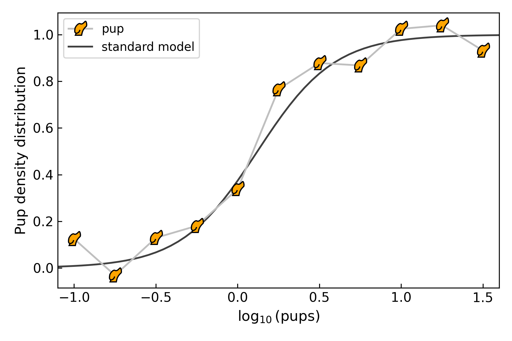

.. _pup_marker:

pup matplotlib marker
=====================

Importing `puppies` automatically enables the user to make Matplotlib
plots with a `pup` marker.  See for example the Python script below:

.. code-block:: python

  # Plot with pup markers:
  import puppies as p
  import scipy.constants as sc
  import scipy.integrate as si
  import matplotlib.pyplot as plt
  import numpy as np
  plt.ion()

  # Some random curve:
  T = 273.0
  mu = 0.1214 * sc.electron_volt
  pups = np.linspace(-1.0, 1.5, 11)
  np.random.seed(10239)
  z0 = 1.0 / (1.0 + np.exp((mu-pups*sc.electron_volt)/(10*sc.k*T)))
  z = np.random.normal(z0, 0.1, len(pups))

  # Expected model:
  t = np.linspace(-2, 2.5, 100)
  def comp_fermi_dirac_int(t,x):
      return 1.0/(np.exp(t-x)+1)
  model = np.array([
      np.exp(-si.quad(comp_fermi_dirac_int, 0.0, np.inf, args=(x,))[0])
      for x in (mu-t*sc.electron_volt)/(10*sc.k*T)
      ])

  fig = plt.figure(0)
  fig.set_size_inches(6, 4)
  plt.clf()
  ax = plt.subplot(111)
  ax.plot(pups, z, marker='pup', mec='k', mfc='orange', c='0.75', label='pup')
  ax.plot(t, model, c='0.25', zorder=-1, label='standard model')
  ax.set_xlabel(r'$\log_{10}({\rm pups})$', fontsize=12)
  ax.set_ylabel('Pup density distribution', fontsize=12)
  ax.tick_params(which='both', direction='in', labelsize=11)
  ax.set_xlim(-1.1, 1.6)
  ax.legend(loc='upper left')
  plt.tight_layout()
  plt.savefig('pup_markers.png', dpi=300)

Which will produce something looking like this:

